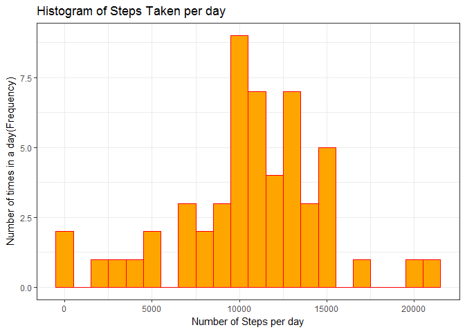
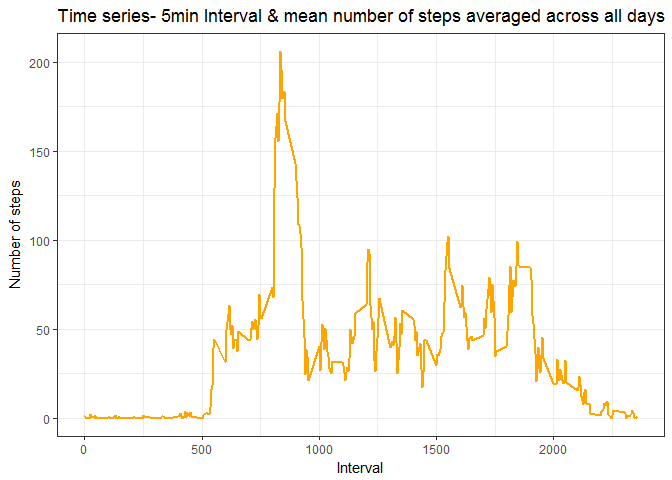
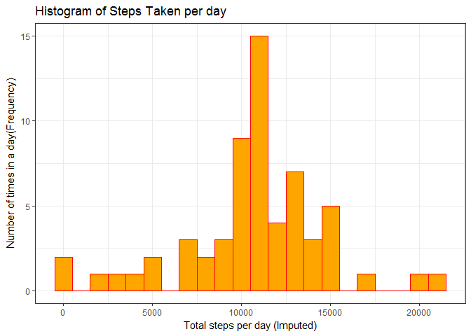
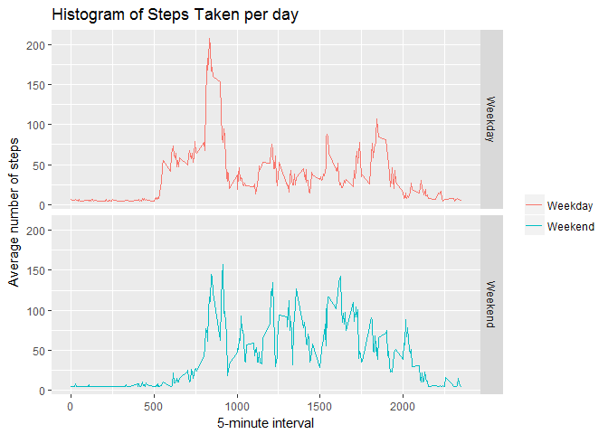

# Reproducible Research: Assessment 01
Sanjay Somraj  
February 24, 2017  


## 1. Loading and preprocessing the data
##### **a. Load the data**

```r
if(!file.exists('activity.csv')){
    unzip('activity.zip')
}
userActivityData <- read.csv('activity.csv')
```
##### **b. Process/transform the data (if necessary)**

```r
# Remove all cases with missing values - NAs
userActivity <- userActivityData[complete.cases(userActivityData),]
```

-----

## 2. What is mean total number of steps taken per day?

```r
stepsPerDay <- aggregate(steps ~ date, userActivity, sum)
```

##### **a. Make a histogram of the total number of steps taken each day**
<!-- -->

##### **b. Calculate and report the mean and median total number of steps taken per day**

```r
stepsMean   <- format(mean(stepsPerDay$steps),nsmall = 2)
stepsMedian <- format(median(stepsPerDay$steps), nsmall = 2)
```

-----

* Mean: 10766.19  
* Median:  10765

-----

## 2. What is the average daily activity pattern?

```r
stepsPerInterval <- aggregate(userActivity$steps, 
                                by = list(interval = userActivity$interval),
                                FUN=mean)
colnames(stepsPerInterval) <- c("interval", "steps")
```

##### **a. Make a time series plot**

```r
ggplot(stepsPerInterval, aes(x=interval, y=steps)) +   
     geom_line(color="orange", size=1) +  
     labs(title="Time series- 5min Interval & mean number of steps averaged across all days", x="Interval", y="Number of steps") +  
     theme_bw()
```

<!-- -->

##### **b. Which 5-minute interval, on average across all the days in the dataset, contains the maximum number of steps?**

```r
maxIntervalData <- stepsPerInterval[which.max(stepsPerInterval$steps),]
maxInterval <- maxIntervalData$interval
maxSteps <- format(maxIntervalData$steps,digits = 2, nsmall = 2)
```

-----

* The **835th** interval has Maximum Steps of **206.17**.

-----

## 3. Imputing missing values
##### **a. Calculate and report the total number of missing values in the dataset**

```r
numMissingValues <- length(which(is.na(userActivityData$steps)))
```

-----

* Number of missing values: 2304

-----

##### **b. Devise a strategy for filling in all of the missing values in the dataset.**
* The missing values can be indentified
* The identified missing values should be replaced with the mean for that column
* The **impute** function in **Hmisc** package is most suitable for this

-----

##### **c. Create a new dataset that is equal to the original dataset but with the missing data filled in.**

```r
userActivityDataImputed <- userActivityData
userActivityDataImputed$steps <- impute(userActivityData$steps, fun=mean)
```

-----

##### **d. Make a histogram of the total number of steps taken each day**

```r
stepsPerDayImputed <- aggregate(steps ~ date, userActivityDataImputed, sum)
ggplot(stepsPerDayImputed, aes(x = steps)) + 
     geom_histogram(col="red", 
                    fill = "orange", 
                    binwidth = 1000) + 
     labs(title="Histogram of Steps Taken per day", 
          x = "Total steps per day (Imputed)", 
          y = "Number of times in a day(Frequency)") + 
     theme_bw()
```

<!-- -->

##### **e. Calculate and report the mean and median total number of steps taken per day.**
##### **   Do these values differ from the estimates from the first part of the assignment?** 

```r
stepsPerDayMeanImputed <- format(mean(stepsPerDayImputed$steps), nsmall = 2)
stepsPerDayMedianImputed <- format(median(stepsPerDayImputed$steps), nsmall = 2)
```

###### **Before Imputing**
* Mean: 10766.19  
* Median:  10765

###### **After Imputing**
* Mean (Imputed): 10766.19
* Median (Imputed):  10766.19

###### **Observations:**
###### 1) The mean values have remained same, while the median has shifted and now macthes the mean
###### 2) On comparing both histograms, we can state that the impact of imputing missing values has increased the peak.

----

##### **e. Calculate and report the mean and median total number of steps taken per day.**

## 5. Are there differences in activity patterns between weekdays and weekends?
##### **a. Create a new factor variable in the dataset with two levels - "weekday" and "weekend" indicating whether a given date is a weekday or weekend day.**


```r
userActivityDataImputed$weekday <- weekdays(as.Date(userActivityDataImputed$date))
userActivityDataImputed$dayType <- ifelse(userActivityDataImputed$weekday %in% c("Saturday","Sunday"), "Weekend","Weekday")
averagedActivityDataImputed <- aggregate(steps ~ interval + dayType, 
                                         data=userActivityDataImputed, mean)
```

##### **b. Make a panel plot containing a time series plot**


```r
ggplot(averagedActivityDataImputed, aes(interval, steps)) + 
    geom_line(aes(col=factor(dayType))) + 
    facet_grid(dayType ~ .) +
     labs(x="5-minute interval",
          y="Average number of steps",
          title = "Histogram of Steps Taken per day")+
     theme(legend.title=element_blank())
```

<!-- -->
